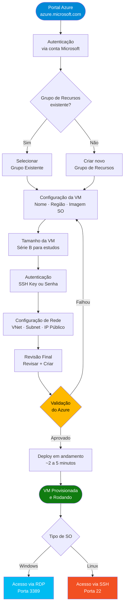

<div align="center">

# Criando uma Máquina Virtual no Azure
### *Creating a Virtual Machine on Azure*

[](https://azure.microsoft.com)
[](https://azure.microsoft.com)
[](https://www.dio.me)
[](./LICENSE)

*Documentação completa do desafio prático de provisionamento de infraestrutura em nuvem com Microsoft Azure.*

*Complete documentation of the cloud infrastructure provisioning challenge with Microsoft Azure.*

</div>

---

## PT-BR | Português

### Sobre o Desafio

Esse repositório documenta minha experiência no desafio prático da DIO de **criação e configuração de uma Máquina Virtual (VM) na plataforma Microsoft Azure**. A ideia foi ir além de apenas completar a tarefa — quis registrar cada etapa de forma que esse material sirva como referência real pra implementações futuras, tanto pra mim quanto pra quem estiver começando com cloud.

O Azure é hoje uma das plataformas de nuvem mais utilizadas no mercado, e saber provisionar recursos por lá é uma habilidade essencial pra qualquer profissional de tecnologia.

---

### Fluxo de Provisionamento da VM



---

### Conceitos Fundamentais

| Conceito | Descrição |
|---|---|
| **Azure Portal** | Interface web centralizada para gerenciar todos os recursos na nuvem Microsoft |
| **Máquina Virtual (VM)** | Computador virtualizado que roda nos datacenters da Microsoft, com total controle do SO |
| **Grupo de Recursos** | Container lógico que agrupa recursos relacionados para facilitar gerenciamento e faturamento |
| **Região** | Localização geográfica do datacenter onde os recursos ficam hospedados (ex: East US, Brazil South) |
| **Imagem do SO** | Sistema operacional pré-configurado da VM (Ubuntu, Windows Server, Red Hat, etc.) |
| **Tamanho da VM** | Define vCPUs, memória RAM e capacidade de armazenamento da instância |
| **VNet** | Rede virtual isolada onde os recursos de nuvem se comunicam com segurança |
| **NSG** | Network Security Group — regras de firewall que controlam o tráfego de entrada e saída |

---

### Passo a Passo — Criando a VM

#### 1. Acessar o Portal

Vá para [portal.azure.com](https://portal.azure.com) e faça login com sua conta Microsoft. Se estiver usando a conta do bootcamp ou a conta gratuita, os créditos já devem estar disponíveis no dashboard.

#### 2. Iniciar a Criação

No menu lateral esquerdo, clique em **Máquinas Virtuais** (ou pesquise na barra superior). Em seguida, clique em **+ Criar** > **Máquina virtual do Azure**.

#### 3. Configurar o Grupo de Recursos

- Selecione uma assinatura (Subscription)
- Crie um novo Grupo de Recursos ou use um existente
- Sugestão de nome: `rg-dio-vm-lab`

#### 4. Definir as Configurações Básicas da VM

```
Nome da VM:    vm-dio-lab
Região:        East US (ou Brazil South, se disponível na tier gratuita)
Imagem:        Ubuntu Server 22.04 LTS (recomendado para estudos Linux)
               ou Windows Server 2022 (para ambientes Windows)
Tamanho:       Standard_B1s (1 vCPU, 1 GB RAM) — ideal para testes
```

#### 5. Configurar a Autenticação

Para VMs Linux, o método recomendado é **chave SSH**:

```bash
# Gerar um par de chaves SSH localmente (se ainda não tiver)
ssh-keygen -t rsa -b 4096 -C "seu-email@exemplo.com"

# A chave pública (~/.ssh/id_rsa.pub) deve ser colada no campo do Portal
```

Para VMs Windows, utilize **usuário e senha** com senha forte (mínimo 12 caracteres, letras, números e símbolos).

#### 6. Configuração de Disco

Para estudos, o disco padrão **OS Disk** com tipo **Standard SSD** já é suficiente. Evite Premium SSD para não consumir créditos desnecessariamente.

#### 7. Configuração de Rede

O Azure cria automaticamente:
- Uma **VNet** (Virtual Network) com o range `10.0.0.0/16`
- Uma **Subnet** com o range `10.0.0.0/24`
- Um **IP público** dinâmico para acesso externo
- Um **NSG** com regras básicas de segurança

Para Linux, certifique-se de que a **porta 22 (SSH)** está liberada. Para Windows, a **porta 3389 (RDP)**.

#### 8. Revisar e Criar

Clique em **Revisar + Criar**. O Azure vai validar todas as configurações. Se aparecer **Validação aprovada**, clique em **Criar** e aguarde alguns minutos.

#### 9. Acessar a VM

**Linux (SSH):**
```bash
# Substituir pelo IP público exibido no Portal
ssh -i ~/.ssh/id_rsa azureuser@<IP_PUBLICO_DA_VM>
```

**Windows (RDP):**
```
Abrir o aplicativo "Conexão de Área de Trabalho Remota"
Host: <IP_PUBLICO_DA_VM>
Usuário: azureuser (ou o nome definido na criação)
```

---

### Dicas Importantes

- **Custo:** Para estudos, sempre escolha VMs da série B (Burstable). Elas são as mais baratas e suficientes pra aprendizado.
- **Desligar quando nao usar:** Uma VM ligada cobra por hora. Desligue ou desaloque o recurso quando terminar. No Portal, clique em **Parar** (não apenas desligar pelo SO).
- **Tags:** Use tags nos recursos (`projeto: dio-bootcamp`, `ambiente: lab`) para organizar e facilitar o controle de gastos.
- **Região:** Prefira regiões dos EUA (East US, West US) pra acessar as VMs gratuitas do tier. Brazil South pode não estar disponível na conta gratuita.
- **Snapshots:** Antes de fazer alterações grandes na VM, tire um snapshot do disco para ter um ponto de restauração.

---

### Estrutura do Repositorio

```
DIO/
├── README.md              <- Documentacao completa do desafio
├── images/                <- Capturas de tela do processo (opcional)
│   ├── portal-dashboard.png
│   ├── vm-config-basica.png
│   ├── vm-rede.png
│   └── vm-rodando.png
├── anotacoes.txt          <- Notas brutas do aprendizado
└── LICENSE
```

---

### Conclusao

Esse desafio foi uma porta de entrada real pro mundo de cloud computing. Ver uma VM sendo provisionada e conseguir acessar ela via SSH/RDP, sabendo que você mesmo configurou cada parametro — desde a rede ate o tipo de autenticacao — e algo que muda a forma como voce ve infraestrutura.

Mais do que completar o desafio, o objetivo aqui foi documentar bem. Uma boa documentacao tecnica e tao importante quanto o codigo em si, e esse repositorio reflete isso.

---

## EN | English

### About the Challenge

This repository documents my hands-on experience with the DIO bootcamp challenge focused on **creating and configuring a Virtual Machine (VM) on the Microsoft Azure platform**. The goal was not just to complete the task — I wanted to record each step so this material serves as a real reference for future implementations.

Azure is one of the most widely used cloud platforms in the industry, and knowing how to provision resources there is an essential skill for any tech professional.

---

### Key Concepts

| Concept | Description |
|---|---|
| **Azure Portal** | Centralized web interface to manage all Microsoft cloud resources |
| **Virtual Machine (VM)** | Virtualized computer running in Microsoft datacenters with full OS control |
| **Resource Group** | Logical container grouping related resources for easier management and billing |
| **Region** | Geographic location of the datacenter hosting resources (e.g., East US, Brazil South) |
| **OS Image** | Pre-configured operating system for the VM (Ubuntu, Windows Server, Red Hat, etc.) |
| **VM Size** | Defines vCPUs, RAM, and storage capacity of the instance |
| **VNet** | Virtual Network — isolated network where cloud resources communicate securely |
| **NSG** | Network Security Group — firewall rules controlling inbound/outbound traffic |

---

### Quick Start

```bash
# After VM is created and running, connect via SSH (Linux VMs)
ssh -i ~/.ssh/id_rsa azureuser@<YOUR_VM_PUBLIC_IP>

# Verify connection is working
hostname && uptime
```

---

### Best Practices

- Always **stop or deallocate** the VM when not in use to avoid unnecessary charges
- Use **B-series VMs** (burstable) for study environments — cheapest and sufficient for labs
- Apply **resource tags** for cost tracking and organization
- For Linux VMs, prefer **SSH key authentication** over passwords
- Create **snapshots** before making major system changes

---

## Licenca / License

Este projeto esta licenciado sob a licenca MIT. Veja o arquivo [LICENSE](./LICENSE) para mais detalhes.

This project is licensed under the MIT License. See the [LICENSE](./LICENSE) file for details.

```
MIT License

Copyright (c) 2024 Gabriel Demetrios Lafis

Permission is hereby granted, free of charge, to any person obtaining a copy
of this software and associated documentation files (the "Software"), to deal
in the Software without restriction, including without limitation the rights
to use, copy, modify, merge, publish, distribute, sublicense, and/or sell
copies of the Software, and to permit persons to whom the Software is
furnished to do so, subject to the following conditions:

The above copyright notice and this permission notice shall be included in all
copies or substantial portions of the Software.

THE SOFTWARE IS PROVIDED "AS IS", WITHOUT WARRANTY OF ANY KIND, EXPRESS OR
IMPLIED, INCLUDING BUT NOT LIMITED TO THE WARRANTIES OF MERCHANTABILITY,
FITNESS FOR A PARTICULAR PURPOSE AND NONINFRINGEMENT. IN NO EVENT SHALL THE
AUTHORS OR COPYRIGHT HOLDERS BE LIABLE FOR ANY CLAIM, DAMAGES OR OTHER
LIABILITY, WHETHER IN AN ACTION OF CONTRACT, TORT OR OTHERWISE, ARISING FROM,
OUT OF OR IN CONNECTION WITH THE SOFTWARE OR THE USE OR OTHER DEALINGS IN THE
SOFTWARE.
```

---

<div align="center">

Feito com dedicacao por [Gabriel Demetrios Lafis](https://github.com/galafis) | DIO Bootcamp — Microsoft Azure

*Made with dedication by [Gabriel Demetrios Lafis](https://github.com/galafis)*

</div>
